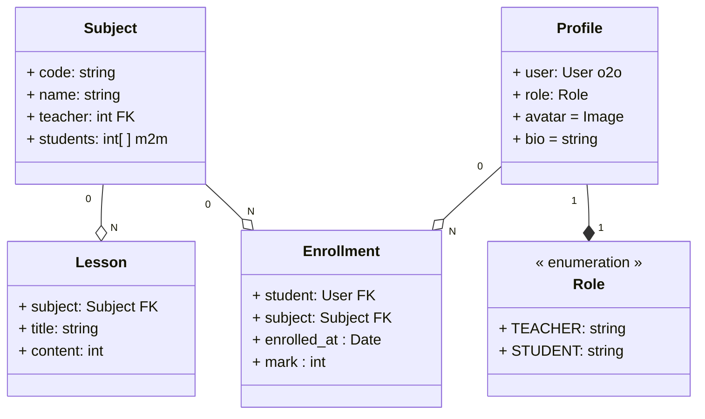

# Diseño del sistema
!!! Info ""
    El proyecto Lumino sigue la arquitectura MTV `(Model–Template–View)`
    !!! quote ""
        Este modelo permite una clara separación de responsabilidades y facilita el mantenimiento del código.

### Model
**Define la estructura de los datos y la lógica de negocio**. En Lumino, los modelos representan entidades como *usuarios, perfiles, asignaturas, matrículas y calificaciones*, gestionando la persistencia y las relaciones entre ellas.

### Template
**Se encarga de la capa de presentación**. Los templates muestran la información al usuario final de forma clara y estructurada, adaptando el contenido según el rol `(alumno o profesor)` y evitando que la lógica de negocio se mezcle con la interfaz.

### View
**Actúa como intermediario entre los modelos y los templates**. Las vistas procesan las peticiones del usuario, aplican las reglas de acceso, obtienen o modifican los datos necesarios y devuelven la respuesta adecuada.

Esta arquitectura permite que cada parte del sistema evolucione de manera independiente, manteniendo una base de código ordenada y comprensible.

## Estructura de pruebas y enfoque TDD
Lumino utiliza un enfoque de desarrollo guiado por pruebas `(TDD)`[^1], donde los tests se definen antes de implementar la funcionalidad correspondiente. Esto garantiza que cada requisito esté claramente especificado y validado desde el inicio.

[^1]: Test-Driven Development

**La estructura de pruebas se organiza por áreas funcionales, cubriendo:**

- [x] **Modelos**, para verificar reglas de negocio y validaciones.
- [x] **Vistas**, para asegurar el comportamiento correcto según el rol del usuario.
- [x] **Flujos** funcionales, como matrícula, asignación de notas o generación de certificados.

??? Info
    Este enfoque permite detectar errores de forma temprana, reforzar la seguridad del sistema y asegurar que la aplicación cumple los requisitos definidos en cada iteración del proyecto.

## Modelo de datos

## Diagrama de Clases

## Decisiones de diseño