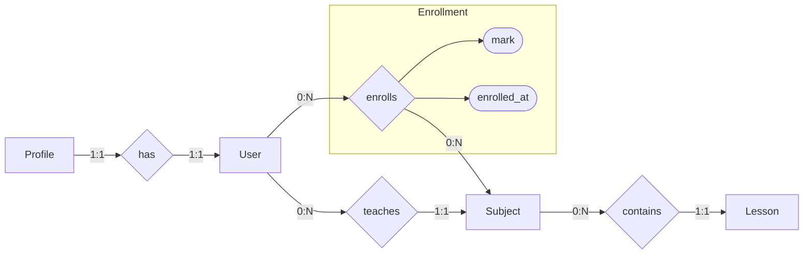
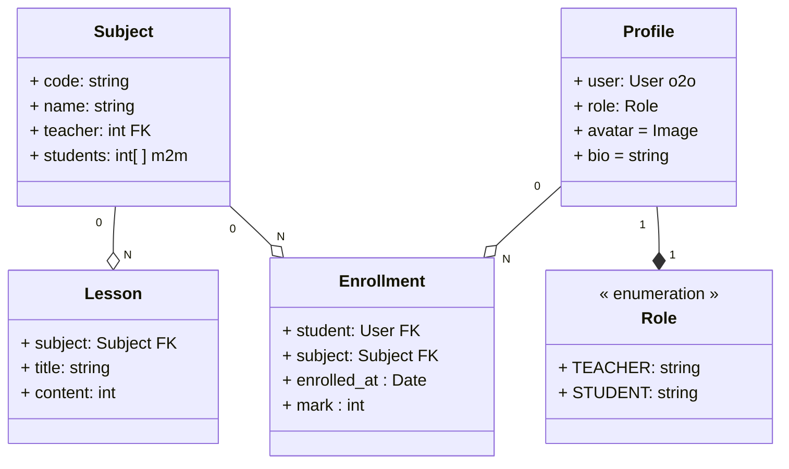

# Diseño del sistema

## Arquitectura del sistema

## Modelo de datos

```mermaid
flowchart LR
P[Profile] --> |1:1| h{has};
h --> |1:1| U[User];
U --> |0:N| t{teaches};
t --> |1:1| S[Subject];

subgraph E[Enrollment]
    direction TB
    e{enrolls} --> m([mark])
    e{enrolls} --> en([enrolled_at])
end

U --> |0:N| e;
e --> |0:N| S;
S --> |0:N| c{contains};
c --> |1:1| L[Lesson];
```

## Diagramas

### Diagrama de Clases

```mermaid
classDiagram
    class Subject {
        + code: string
        + name: string
        + teacher: int FK
        + students: int[ ] m2m
    }

    class Lesson {
        + subject: Subject FK
        + title: string
        + content: int 
    }

    class Enrollment {
        + student: User FK
        + subject: Subject FK
        + enrolled_at : Date
        + mark : int
    }
     

    class Profile {
        + user: User o2o
        + role: Role
        + avatar = Image
        + bio = string
    }

    class Role {
        << enumeration >>
        + TEACHER: string
        + STUDENT: string
    }

    Profile "1" --* "1" Role
    Profile "0" --o "N" Enrollment
    Subject "0" --o "N" Enrollment 
    Subject "0" --o "N" Lesson 
```

### Diagrama de Secuencia

## Decisiones de diseño