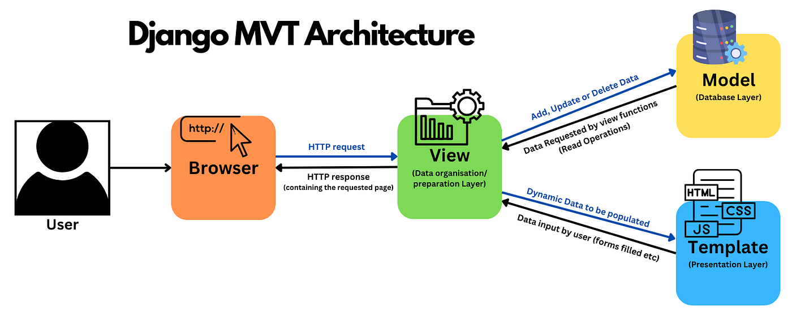

# Implementación
En el desarrollo de **Lumino** se utilizan varias herramientas y mecanismos propios de Django que constituyen la base técnica del proyecto y permiten implementar la lógica del campus virtual de forma estructurada y mantenible.

La **conexión con la base de datos** se gestiona a través del ORM de Django, que abstrae el acceso a los datos y permite trabajar con ellos mediante clases y objetos en lugar de consultas SQL directas. Esto facilita la definición de modelos como *usuarios, asignaturas, matrículas o calificaciones*, así como la gestión de relaciones entre ellos, manteniendo la coherencia y reduciendo errores en la manipulación de la información.

El proyecto está construido siguiendo principios de **programación orientada a objetos**, donde los modelos, vistas y formularios encapsulan comportamiento y estado. Este enfoque permite reutilizar código, extender funcionalidades de forma controlada y mantener una estructura clara, especialmente importante en una aplicación con distintos roles y reglas de negocio bien definidas.

{ loading=lazy }
/// caption
Django MVT Architecture
///

Lumino hace uso de **comandos de gestión** de Django para realizar tareas administrativas y de mantenimiento. Estos comandos permiten ejecutar acciones específicas desde la línea de comandos, como inicializar datos, gestionar usuarios o lanzar procesos internos, sin necesidad de interactuar directamente con la interfaz web. Esto resulta especialmente útil en entornos de desarrollo y despliegue.

Las **señales de Django** se emplean para reaccionar automáticamente a determinados eventos del sistema, como la creación o modificación de objetos. Este mecanismo permite desacoplar la lógica principal de acciones secundarias, por ejemplo, desencadenar procesos asociados a cambios de estado sin sobrecargar las vistas o los modelos.

El **sistema de correo** es otro componente clave del proyecto. Lumino utiliza un servicio externo para el envío de correos transaccionales, integrado con Django y ejecutado mediante tareas en segundo plano. Este sistema se emplea para notificaciones importantes y para el envío automático de certificados en formato PDF, garantizando fiabilidad y evitando bloqueos en la experiencia del usuario.

!!! quote
    En conjunto, estas herramientas permiten que Lumino funcione como una aplicación coherente, modular y preparada para crecer, combinando las capacidades nativas de Django con servicios externos que amplían sus posibilidades sin comprometer la claridad del diseño.


## Instrucciones de configuración
A continuación se describen los **pasos necesarios para configurar el entorno de desarrollo de Lumino**, desde la creación del entorno virtual hasta la instalación de las dependencias del proyecto.

## Configuración del entorno del proyecto
Antes de comenzar, es necesario disponer de:

* **Python** instalado `(versión compatible con el proyecto)`.
* **Gestor de paquetes `pip`**.
* Acceso al repositorio del proyecto *Lumino*.

---

Para aislar las dependencias del proyecto y evitar conflictos con otros desarrollos, se crea un **entorno virtual**:

```bash
python -m venv venv
```

Activación del entorno virtual:

  ```bash
  source venv/bin/activate
  ```

---

### Instalación de dependencias

Con el entorno virtual activo, se instalan las dependencias del proyecto utilizando `pip`:

```bash
pip install -r requirements.txt
```

Entre las principales dependencias se incluyen:


<div class="grid cards" markdown>

* **sorl-thumbnail**
* **django-rq**
* **django-markdownify**
* **prettyconf**
* **WeasyPrint**
* **Cliente de Brevo para envío de correos**
</div>


---

### Configuración de variables de entorno

Las credenciales y configuraciones sensibles se gestionan mediante **variables de entorno**, leídas desde Django con `prettyconf`. Esto incluye, entre otras:

* Claves de acceso al servicio de correo `(Brevo)`.
* Configuración de base de datos.
* Clave secreta de Django.

Este enfoque evita exponer información sensible en el código fuente.

---

### Verificación del entorno

Para comprobar que el entorno está correctamente configurado:

* Ejecutar las migraciones de la base de datos.
* Iniciar el servidor de desarrollo.
* Acceder a la aplicación desde el navegador.

Si la aplicación se inicia sin errores, el entorno de desarrollo está listo para su uso.

---

## Estructura del código 
```
lumino
├── accounts
│   ├── admin.py
│   ├── forms.py
│   ├── locale
│   ├── migrations
│   ├── models.py
│   ├── signals.py
│   ├── templates
│   ├── urls.py
│   └── views.py
├── db.sqlite3
├── justfile
├── justfile.bak
├── main
│   ├── settings.py
│   └── urls.py
├── manage.py
├── media
│   ├── avatars
│   ├── cache
│   └── certificates
├── pyproject.toml
├── shared
│   ├── admin.py
│   ├── apps.py
│   ├── locale
│   ├── migrations
│   ├── models.py
│   ├── templates
│   ├── templatetags
│   └── views.py
├── subjects
│   ├── admin.py
│   ├── apps.py
│   ├── context_processors.py
│   ├── converters.py
│   ├── forms.py
│   ├── management
│   ├── migrations
│   ├── models.py
│   ├── tasks.py
│   ├── templates
│   ├── urls.py
│   └── views.py
├── tests
│   ├── test_accounts.py
│   ├── test_admin.py
│   ├── test_context_processors.py
│   ├── test_core.py
│   ├── test_design.py
│   ├── test_management_commands.py
│   ├── test_shared.py
│   ├── test_signals.py
│   ├── test_subjects.py
│   └── test_users.py
└── users
    ├── admin.py
    ├── apps.py
    ├── converters.py
    ├── forms.py
    ├── migrations
    ├── models.py
    ├── templates
    ├── urls.py
    └── views.py
```