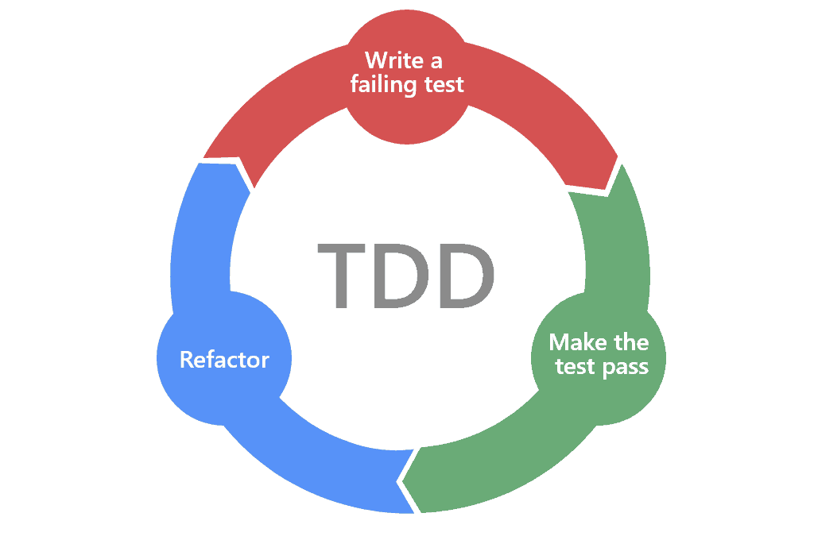

# Pruebas
{ width="500", align=right }
Lumino sigue una metodología de desarrollo basada en **tests**, donde las pruebas se definen **antes de la implementación del código**. Este enfoque, alineado con prácticas de *Test-Driven Development (TDD)*, permite establecer desde el inicio los requisitos funcionales y técnicos que la aplicación debe cumplir.

Los tests verifican el **correcto funcionamiento de la plataforma** en sus distintos niveles, incluyendo flujos de usuario, control de permisos por rol y validación de datos. Gracias a este proceso, cualquier cambio en el código puede evaluarse de forma inmediata, reduciendo el riesgo de introducir errores o comportamientos no deseados.

Además, esta estrategia contribuye a:

- [x] **Prevenir brechas de seguridad**, asegurando que los accesos y acciones estén correctamente restringidos.
- [x] Garantizar que la aplicación **cumple los requisitos definidos** antes de pasar a producción.
- [x] Facilitar el mantenimiento y la evolución del proyecto a largo plazo.

Como resultado, Lumino ofrece una base sólida, fiable y verificable, donde la calidad y la seguridad forman parte integral del proceso de desarrollo.

---

## Casos de prueba

En **Lumino**, las pruebas están organizadas de forma que reflejan directamente la estructura y los componentes principales de la aplicación. Esta separación permite aislar responsabilidades y entender con claridad qué parte del sistema se está validando en cada momento. Existen tests centrados en el **núcleo de la aplicación**, que verifican los flujos generales y el comportamiento global:

- tests específicos de **cada objeto o modelo**
- orientados a comprobar reglas de negocio
- validaciones 
- relaciones

y tests de **autenticación**, que aseguran que los procesos de registro, acceso y control de permisos funcionan correctamente según el rol del usuario.

!!! Example
    Este test comprueba que todas las apps requeridas han sido creadas, de esta forma nos aseguramos que no nos olvidamos de nada y aumentamos la eficiencia en caso de posibles futuros errores.
    ```py
    @pytest.mark.django_db
    def test_required_apps_are_installed():
        REQUIRED_APPS = ('shared', 'accounts', 'subjects', 'users')

        custom_apps = [app for app in settings.INSTALLED_APPS if not app.startswith('django')]
        for app in REQUIRED_APPS:
            app_config = f'{app}.apps.{app.title()}Config'
            assert app_config in custom_apps, (
                f'La aplicación <{app}> no está "creada/instalada" en el proyecto.'
            )
        assert len(custom_apps) >= len(REQUIRED_APPS), (
            'El número de aplicaciones propias definidas en el proyecto no es correcto.'
        )
    ```

--- 

## Automatización

Aunque actualmente los tests **no se ejecutan de forma automática dentro de un pipeline de integración continua**, el proyecto cuenta con un mecanismo que facilita su ejecución manual y reduce errores humanos. Para ello se utiliza un **`justfile`**, que es un archivo de configuración asociado a la herramienta *Just*. Este archivo actúa como una **chuleta de comandos**, definiendo recetas reutilizables que permiten ejecutar tareas complejas con una sola orden, sin necesidad de recordar comandos largos o parámetros específicos.

Gracias a este enfoque, cualquier desarrollador puede lanzar los tests de manera consistente y rápida, manteniendo un control razonable de la calidad del código incluso sin automatización completa. Esta solución sirve como paso intermedio hacia una futura integración de tests totalmente automatizada dentro del proceso de despliegue continuo.
